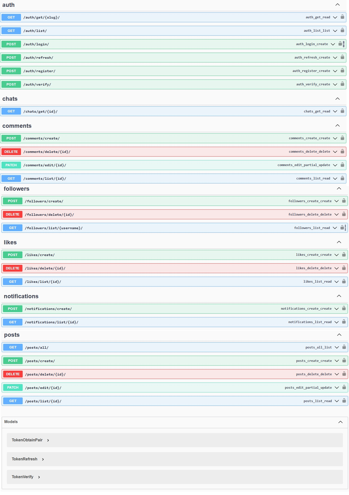

# 🧠 Red Social API - Django REST Framework

Este proyecto es una API RESTful para una red social construida con Django y Django REST Framework. Incluye funcionalidades de autenticación, publicaciones, comentarios, seguidores, notificaciones y más.

---

## 🚀 Endpoints Disponibles

### 🔐 Autenticación (`/auth/`)

| Método | Endpoint                  | Descripción                  |
|--------|---------------------------|------------------------------|
| GET    | `/auth/get/{slug}/`       | Obtener información de usuario (`auth_get_read`) |
| GET    | `/auth/list/`             | Listar todos los usuarios (`auth_list_list`) |
| POST   | `/auth/login/`            | Iniciar sesión y obtener token JWT (`auth_login_create`) |
| POST   | `/auth/refresh/`          | Refrescar token JWT (`auth_refresh_create`) |
| POST   | `/auth/register/`         | Registrar un nuevo usuario (`auth_register_create`) |
| POST   | `/auth/verify/`           | Verificar token JWT (`auth_verify_create`) |

---

### 💬 Chats (`/chats/`)

| Método | Endpoint                | Descripción                    |
|--------|-------------------------|--------------------------------|
| GET    | `/chats/get/{id}/`      | Obtener información de un chat (`chats_get_read`) |

---

### 💭 Comentarios (`/comments/`)

| Método | Endpoint                     | Descripción                      |
|--------|------------------------------|----------------------------------|
| POST   | `/comments/create/`          | Crear un nuevo comentario (`comments_create_create`) |
| DELETE | `/comments/delete/{id}/`     | Eliminar un comentario (`comments_delete_delete`) |
| PATCH  | `/comments/edit/{id}/`       | Editar un comentario (`comments_edit_partial_update`) |
| GET    | `/comments/list/{id}/`       | Listar comentarios por post ID (`comments_list_read`) |

---

### 👥 Seguidores (`/followers/`)

| Método | Endpoint                        | Descripción                        |
|--------|----------------------------------|------------------------------------|
| POST   | `/followers/create/`            | Seguir a un usuario (`followers_create_create`) |
| DELETE | `/followers/delete/{id}/`       | Dejar de seguir (`followers_delete_delete`) |
| GET    | `/followers/list/{username}/`   | Ver seguidores de un usuario (`followers_list_read`) |

---

### ❤️ Likes (`/likes/`)

| Método | Endpoint                  | Descripción                      |
|--------|---------------------------|----------------------------------|
| POST   | `/likes/create/`          | Dar like a un post o comentario (`likes_create_create`) |
| DELETE | `/likes/delete/{id}/`     | Quitar like (`likes_delete_delete`) |
| GET    | `/likes/list/{id}/`       | Obtener likes por ID (`likes_list_read`) |

---

### 🔔 Notificaciones (`/notifications/`)

| Método | Endpoint                    | Descripción                         |
|--------|-----------------------------|-------------------------------------|
| POST   | `/notifications/create/`    | Crear una notificación (`notifications_create_create`) |
| GET    | `/notifications/list/{id}/` | Listar notificaciones de un usuario (`notifications_list_read`) |

---

### 📝 Publicaciones (`/posts/`)

| Método | Endpoint                | Descripción                        |
|--------|-------------------------|------------------------------------|
| GET    | `/posts/all/`           | Listar todas las publicaciones (`posts_all_list`) |
| POST   | `/posts/create/`        | Crear una nueva publicación (`posts_create_create`) |
| DELETE | `/posts/delete/{id}/`   | Eliminar publicación (`posts_delete_delete`) |
| PATCH  | `/posts/edit/{id}/`     | Editar publicación (`posts_edit_partial_update`) |
| GET    | `/posts/list/{id}/`     | Listar publicaciones por usuario o ID (`posts_list_read`) |

---

## 🔐 Modelos de Token (JWT)

- `TokenObtainPair` – Obtener tokens de acceso y refresco
- `TokenRefresh` – Refrescar token de acceso
- `TokenVerify` – Verificar si un token es válido

> Basado en `SimpleJWT`, ideal para autenticación segura con JWT.

---

## 🛠️ Tecnologías Usadas

- Python
- Django
- Django REST Framework
- Simple JWT
- drf-yasg (para documentación Swagger)

---

## 🖼️ Vista Previa



---

## 📂 Estructura del Proyecto

```bash
.
├── apps/
│   ├── chats/
│   ├── comments/
│   ├── followers/
│   ├── likes/
│   ├── notifications/
│   ├── posts/
│   └── user/
├── core/         
├── manage.py
├── requirements.txt
├── README.md